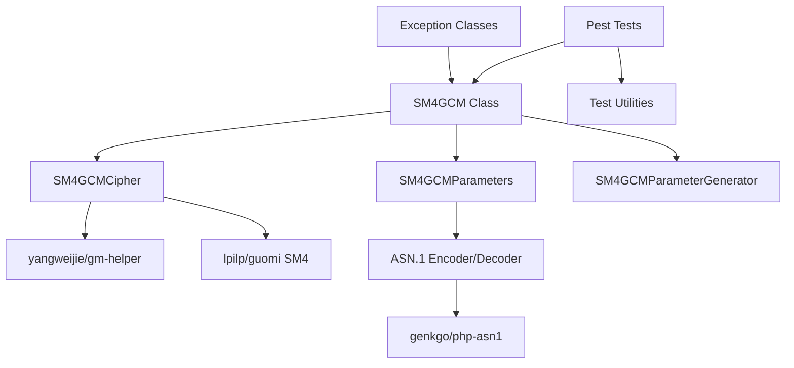
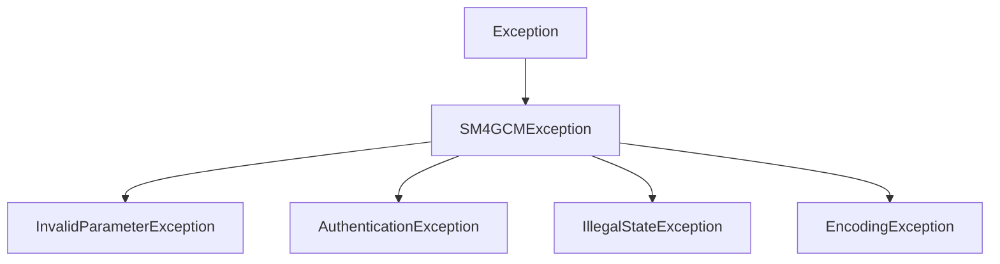

# Design Document

## Overview

This design document outlines the architecture and implementation approach for SM4-GCM (Galois/Counter Mode) encryption and decryption in PHP. The implementation will leverage existing cryptographic libraries (yangweijie/gm-helper and lpilp/guomi) while providing a clean, well-tested interface that mirrors the functionality of the Java kona-crypto reference implementation.

The design follows object-oriented principles with clear separation of concerns, comprehensive error handling, and extensive test coverage using the Pest testing framework.

## Architecture

### High-Level Architecture



### Layer Architecture

1. **API Layer**: Public interfaces for SM4-GCM operations
2. **Implementation Layer**: Core SM4-GCM logic and state management
3. **Integration Layer**: Adapters for existing cryptographic libraries
4. **Utility Layer**: Parameter handling, encoding/decoding, and helper functions
5. **Test Layer**: Comprehensive test suite with utilities

## Components and Interfaces

### Core Classes

#### SM4GCM
The main entry point for SM4-GCM operations.

```php
class SM4GCM
{
    public function __construct(string $key, string $iv, int $tagLength = 128);
    public function encrypt(string $plaintext, string $aad = ''): string;
    public function decrypt(string $ciphertext, string $aad = ''): string;
    public function updateAAD(string $aad): void;
    public function reset(): void;
}
```

#### SM4GCMCipher
Internal cipher implementation handling the actual cryptographic operations.

```php
class SM4GCMCipher
{
    public function init(string $key, string $iv, int $tagLength, bool $encrypt): void;
    public function updateAAD(string $aad): void;
    public function update(string $data): string;
    public function doFinal(string $data = ''): string;
    public function reset(): void;
}
```

#### SM4GCMParameters
Parameter management and validation.

```php
class SM4GCMParameters
{
    public function __construct(string $iv, int $tagLength = 128);
    public function getIV(): string;
    public function getTagLength(): int;
    public function encode(): string;
    public static function decode(string $encoded): self;
    public function validate(): void;
}
```

#### SM4GCMParameterGenerator
Secure parameter generation.

```php
class SM4GCMParameterGenerator
{
    public function generateIV(): string;
    public function generateParameters(int $tagLength = 128): SM4GCMParameters;
}
```

### Exception Classes

```php
class SM4GCMException extends Exception {}
class InvalidParameterException extends SM4GCMException {}
class AuthenticationException extends SM4GCMException {}
class IllegalStateException extends SM4GCMException {}
class EncodingException extends SM4GCMException {}
```

### Utility Classes

#### CryptoUtils
Helper functions for data conversion and validation.

```php
class CryptoUtils
{
    public static function toHex(string $bytes): string;
    public static function toBytes(string $hex): string;
    public static function secureRandom(int $length): string;
    public static function constantTimeEquals(string $a, string $b): bool;
}
```

## Data Models

### GCM State Management

The implementation maintains internal state for GCM operations:

```php
class GCMState
{
    private string $key;
    private string $iv;
    private int $tagLength;
    private bool $encryptMode;
    private string $aad = '';
    private bool $aadFinalized = false;
    private array $ctrBlocks = [];
    private string $authKey;
    private array $ghashState;
}
```

### Parameter Encoding Format

Following the Java implementation, parameters are encoded using ASN.1 DER format:

```
SM4GCMParameters ::= SEQUENCE {
    iv OCTET STRING (SIZE(12)),
    tagLength INTEGER
}
```

## Integration Strategy

### yangweijie/gm-helper Integration

The design leverages the existing gm-helper library for:
- Basic SM4 block cipher operations
- Key validation and management
- Utility functions for hex/byte conversion

### lpilp/guomi Integration

The lpilp/guomi library provides:
- Core SM4 encryption/decryption primitives
- Block cipher implementation
- Cryptographic constants and utilities

### ASN.1 Encoding Integration

Using genkgo/php-asn1 for:
- Parameter encoding/decoding
- DER format compliance
- Cross-platform compatibility

## Error Handling

### Exception Hierarchy



### Error Scenarios

1. **Invalid Key Length**: Throw InvalidParameterException
2. **Invalid IV Length**: Throw InvalidParameterException
3. **Authentication Failure**: Throw AuthenticationException
4. **State Violations**: Throw IllegalStateException
5. **Encoding Errors**: Throw EncodingException

### Security Considerations

- Constant-time comparison for authentication tags
- Secure memory clearing after operations
- IV reuse detection and prevention
- Proper exception handling without information leakage

## Testing Strategy

### Test Structure

```
tests/
├── Unit/
│   ├── SM4GCMTest.php
│   ├── SM4GCMCipherTest.php
│   ├── SM4GCMParametersTest.php
│   ├── SM4GCMParameterGeneratorTest.php
│   └── CryptoUtilsTest.php
├── Integration/
│   ├── LibraryIntegrationTest.php
│   └── CrossPlatformCompatibilityTest.php
├── Feature/
│   ├── EncryptionDecryptionTest.php
│   ├── AADHandlingTest.php
│   ├── ParameterGenerationTest.php
│   └── ErrorHandlingTest.php
└── Utilities/
    └── TestHelper.php
```

### Test Coverage Requirements

1. **Functional Tests**: All encryption/decryption scenarios
2. **Edge Case Tests**: Empty data, null inputs, boundary conditions
3. **Error Tests**: All exception scenarios
4. **Compatibility Tests**: Cross-platform data exchange
5. **Performance Tests**: Large data handling
6. **Security Tests**: IV reuse, tag manipulation

### Test Data

Using test vectors from:
- Java kona-crypto test suite
- SM4-GCM standard test vectors
- Custom edge case scenarios

## Implementation Phases

### Phase 1: Core Infrastructure
- Exception classes
- Utility functions
- Basic parameter handling

### Phase 2: SM4-GCM Implementation
- Core cipher implementation
- GCM mode logic
- State management

### Phase 3: Parameter Management
- Parameter generation
- ASN.1 encoding/decoding
- Validation logic

### Phase 4: Integration
- Library integration
- API finalization
- Error handling refinement

### Phase 5: Testing
- Comprehensive test suite
- Cross-platform validation
- Performance optimization

## Security Design Principles

### Cryptographic Security
- Use cryptographically secure random number generation
- Implement proper GCM authentication
- Prevent IV reuse attacks
- Constant-time operations where applicable

### Implementation Security
- Input validation at all entry points
- Secure memory handling
- Proper error handling without information leakage
- Thread-safe operations where needed

### API Security
- Clear separation between public and private methods
- Immutable parameter objects where possible
- Defensive copying of sensitive data
- Comprehensive input sanitization

## Performance Considerations

### Optimization Strategies
- Efficient memory usage for large data
- Minimal object creation in hot paths
- Lazy initialization where appropriate
- Batch processing for segmented operations

### Memory Management
- Explicit cleanup of sensitive data
- Efficient buffer management
- Minimal memory footprint
- Garbage collection friendly design

### Scalability
- Support for streaming operations
- Efficient handling of large datasets
- Minimal state retention
- Reusable cipher instances